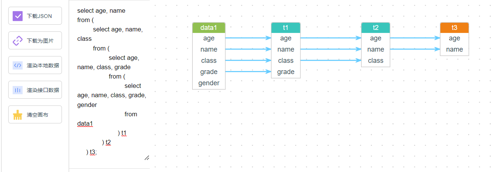
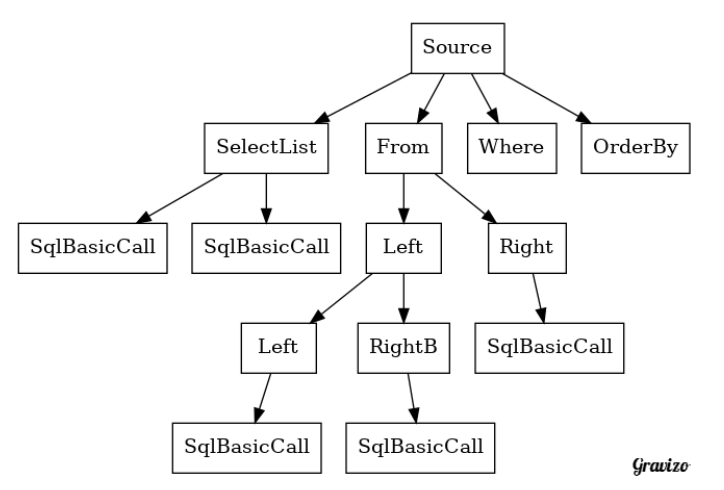

# 介绍

本项目是一个不依赖元数据的 sql 解析器，将最后解析的 sql 血缘关系图展示在页面上。

# 使用说明

在文本框中输入 sql 语句，然后点击渲染接口数据，就可以看到 sql 血缘关系图。

例如，在文本框输入下面的 sql 语句
```sql
select age, name
from (
         select age, name, class
         from (
                  select age, name, class, grade
                  from (
                           select age, name, class, grade, gender
                           from data1
                       ) t1
              ) t2
     ) t3;
```

展示如下图：



# 解析过程

类似于二叉树

<details>   
<summary>graphviz</summary>   


</details>




# 测试网址

http://106.14.150.229:8080/


# 注意

- 使用 Java17
- 尽量将字段写全
- 子函数要写别名
- 目前是在后端处理的坐标，后期需要在前端处理

# 待解决问题

- [ ] 支持 * ，通过谓词，排序，join 条件等反馈补全的表名
- [ ] queryxxx.sql 都需要测试通过
- [ ] 目前不支持 join 操作
- [ ] 后期可以搞一个数据结构将没有表名，但有列名和.的获取到补全列名 (orderby 和 group by)
- [ ] 高并发下有问题
- [ ] 在前端处理坐标

# 参考
- 本项目的前端使用了 [此](https://github.com/mizuhokaga/jsplumb-dataLineage-vue) 项目。
- http://jsfiddle.net/rayflex/La9p4/

